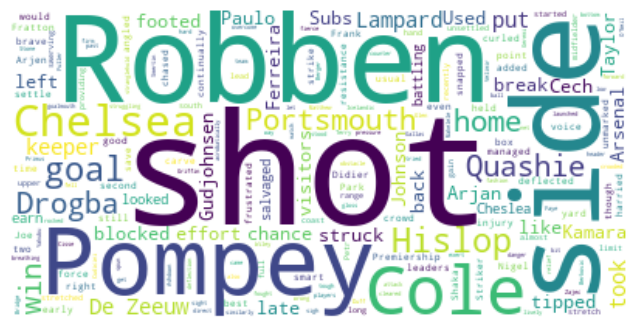
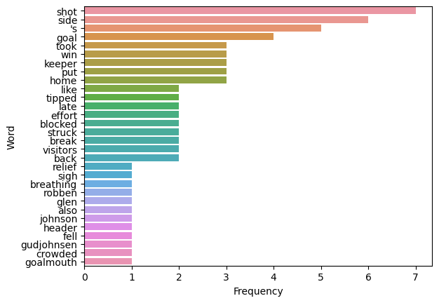

### Capstone Project - Text Summarization & Text Classification

**Naga Jyothi Patchigolla**

#### Executive summary

#### Rationale

As a Program Manager, I do capture meeting notes and action items for every meeting summarizing all the points of discussion. I see there are many summarizing platforms available now, there is one on zoom as well that automatically creates meeting notes from a meeting transcript. It’s important for me to understand how these summaries are generated and how reliable they are, so that we can use them with confidence.
Also, it's important to understand how the model classifies text as decisions or action items or just notes.

#### Research Question

What are different ways to summarize a text? 
And how good is the summarized text that’s generated out of the NLP models?
What is the best classification model to classify the text?

#### Data Sources

Data source: Kaggle

Dataset used: https://www.kaggle.com/datasets/pariza/bbc-news-summary

Description: This dataset for extractive text summarization has total of 2225 news articles of BBC from 2004 to 2005 in the News Articles folder. For each article, summaries are provided. 

### TEXT SUMMARIZATION

#### Methodology

In this notebook, I have generated summaries using both Abstractive and Extractive methods for the tech articles. 
Calculated and compared the Corpus_Bleu scores for each of the summaries with reference to the summaries from Kaggle dataset.
Created wordcloud, word frequencies bar chart visualizations and printed sentence scores for the user requested text input.

#### Techniques:

Used Natural Language Processing (NLP) NLTK took kit  do the extractive summarization and Hugging face transformers for abstractive summarization
Used corpus_bleu scores to measure the quality/match of the summary generated to the summary from the dataset.

Created two User prompt codes 
1. Take number of articles user want to create summary for. Ask for expected summary length as well.
2. Take the text as input from the user and create wordcloud, word frequencies bar chart visualizations and print sentence scores. Generate summary as per user input

#### Read the Text File

**Standalone:**
1. Downloaded the BBC News, Tech News Articles and Summaries from the dataset from Kaggle
2. Using the Python's built-in **os** module accessed the local directory directories, and created a path for each of the text files present in the directory. 
3. Created a dataframe with 'path','filename' and 'category' as the columns. 'category' column indicates to which category this file belongs to like business, entertainment, sports etc.
4. Created a prompt for user to provide number of random articles they want to summarize and the summary length expected. 5. Based on received user input, randomly picked the articles from the dataframe and generated the Extractive and Abstractive summaries for each article

**User Input:**
1. Prompted user to provide the text for which they want to see the visualizations and the summary
2. Also took summary length as the % of original text they would like to see as summary

#### Summarization Process

Read the text from the file and performed below steps to generate summary

**Extractive Text Summarization**

1. Generated word tokens using word_tokenize()function. 
2. Created a word frequencies dictionary for the words frequencies for the words that are not in punctuation or stopwords.
3. Used sent_tokenize function to generat sentence tokens. 
4. Based on word frequency dictionary, parsed and scored the sentences with the words present in them.
5. Took the top 30% or 40% of the sentences based on user request and generated the summary. 

**Abstractive Text Summarization**

1. Installed the transformers to import pipeline
2. Instantiated the Summarization pipeline
3. Provided the text and required summary length as input to the summarizer and generated the summary

#### Quality Measurement

BLEU (Bilingual Evaluation Understudy) scores indicate how similar the candidate text is to the reference text. These scores are essential to measure the quality of generated text.

1. For every article, calculated the corpus_bleu scores for both extractive and abstractive summaries with reference to the summary from the Kaggle dataset for that article
2. Created a dataframe to compare the scores for the summaries.

#### Visualizations
Created WordCloud to showcase the high frequency words in the text and also created a barchart to visualize the frequency of the words.

#### Results

Compared the BLEU scores for the summaries generated. As the bleu score relies on the matching n-gramsm, extractive summarization was scored higher than the summaries generated from the abstractive summarization.

This is in-line with what was expected.

#### Next steps
Need to explore the other text evaluation techniques that are not based on the n-grams to efficiently calculate the score for abstractive summaries with reference to the summaries from the dataset.

#### Outline of project
Link to Jupyter notebook - Capstone Project - Text Summarization

##### Contact and Further Information
Naga Jyothi Patchigolla

#### More Information:
Using OS module, navigating through the local directories for the News Articles
Created a dataframe out of the local directory and files to read each of them easily

<table border="1" class="dataframe">
  <thead>
    <tr style="text-align: right;">
      <th></th>
      <th>path</th>
      <th>filename</th>
      <th>category</th>
    </tr>
  </thead>
  <tbody>
    <tr>
      <th>0</th>
      <td>C:/Users/neofu/Downloads/Jyothi UCB/BBC News S...</td>
      <td>001.txt</td>
      <td>sport</td>
    </tr>
    <tr>
      <th>1</th>
      <td>C:/Users/neofu/Downloads/Jyothi UCB/BBC News S...</td>
      <td>002.txt</td>
      <td>sport</td>
    </tr>
    <tr>
      <th>2</th>
      <td>C:/Users/neofu/Downloads/Jyothi UCB/BBC News S...</td>
      <td>003.txt</td>
      <td>sport</td>
    </tr>
    <tr>
      <th>3</th>
      <td>C:/Users/neofu/Downloads/Jyothi UCB/BBC News S...</td>
      <td>004.txt</td>
      <td>sport</td>
    </tr>
    <tr>
      <th>4</th>
      <td>C:/Users/neofu/Downloads/Jyothi UCB/BBC News S...</td>
      <td>005.txt</td>
      <td>sport</td>
    </tr>
  </tbody>
</table>

Using OS module, navigating through the local directories and created a dataframe for Summaries

<table border="1" class="dataframe">
  <thead>
    <tr style="text-align: right;">
      <th></th>
      <th>path</th>
      <th>filename</th>
      <th>category</th>
    </tr>
  </thead>
  <tbody>
    <tr>
      <th>0</th>
      <td>C:/Users/neofu/Downloads/Jyothi UCB/BBC News S...</td>
      <td>001.txt</td>
      <td>sport</td>
    </tr>
    <tr>
      <th>1</th>
      <td>C:/Users/neofu/Downloads/Jyothi UCB/BBC News S...</td>
      <td>002.txt</td>
      <td>sport</td>
    </tr>
    <tr>
      <th>2</th>
      <td>C:/Users/neofu/Downloads/Jyothi UCB/BBC News S...</td>
      <td>003.txt</td>
      <td>sport</td>
    </tr>
    <tr>
      <th>3</th>
      <td>C:/Users/neofu/Downloads/Jyothi UCB/BBC News S...</td>
      <td>004.txt</td>
      <td>sport</td>
    </tr>
    <tr>
      <th>4</th>
      <td>C:/Users/neofu/Downloads/Jyothi UCB/BBC News S...</td>
      <td>005.txt</td>
      <td>sport</td>
    </tr>
  </tbody>
</table>

#### Receive user input, call the defined abstract and extractive summarization functions, and generate summary and bleu scores

    Provide Number of Articles you want to generate summaries for(mention a number between 1 and 5): 2
    Provide summary size in % of original text. For ex: 0.3 or 0.4 etc.0.3
    
    FOR ARTICLE # 278
        
    Summary from Extractive Summarization: 
    
    Newcastle line up Babayaro
    
    Newcastle manager Graeme Souness is closing in on signing Chelsea defender Celestine Babayaro when the transfer window reopens. But he said: "All I can tell you is that the chairman has worked really hard in the last couple of months to try to do deals.
    
    
    Summary from Abstractive Summarization: 
    
     Newcastle manager Graeme Souness is closing in on signing Chelsea defender Celestine Babayaro . The 26-year-old has been surplus to requirements this season . Babayar has been in
    
    
    Summary from Kaggle Dataset: 
    
    Babayaro has been in the Premiership since 1997 when he moved to Chelsea for £2.25m from Anderlecht.Newcastle manager Graeme Souness is closing in on signing Chelsea defender Celestine Babayaro when the transfer window reopens.But he said: "All I can tell you is that the chairman has worked really hard in the last couple of months to try to do deals.
    
    FOR ARTICLE # 285
       
    Summary from Extractive Summarization: 
    
    "We didn't play last week against Scotland and we didn't play in the first half against England," he said. When you miss some it's very hard mentally, but it went well for us," he said. "We know we have to play better to defend the title," he said. "I'm not happy we didn't score a try but we're happy because we won."
    
    Summary from Abstractive Summarization: 
    
    France beat England 18-17 in Six Nations clash at Twickenham . Dimitri Yachvili kicked all of France's points as they staged a second-half revival . England's Charlie Hodgson and Olly Barkley missed six penalties and a drop goal chance .
       
    Summary from Kaggle Dataset: 
    
    "We didn't play last week against Scotland and we didn't play in the first half against England," he said."We said we only had 11 points against us, which was not much.When you miss some it's very hard mentally, but it went well for us," he said.France scrum-half Dimitri Yachvili praised his team after they fought back to beat England 18-17 in the Six Nations clash at Twickenham."We know we have to play better to defend the title," he said.We were just defending in the first half and we said we had to put them under pressure.France were 17-6 down at half-time, but Pelous said: "No-one was down at half-time, we were still confident.
    

<table border="1" class="dataframe">
  <thead>
    <tr style="text-align: right;">
      <th></th>
      <th>Article #</th>
      <th>Abstract_scores</th>
      <th>Extract_scores</th>
    </tr>
  </thead>
  <tbody>
    <tr>
      <th>0</th>
      <td>278</td>
      <td>0.2879</td>
      <td>0.7229</td>
    </tr>
    <tr>
      <th>1</th>
      <td>285</td>
      <td>0.1166</td>
      <td>0.3182</td>
    </tr>
  </tbody>
</table>

#### Observation

From the above bleu scores it shows for aritle 278 from Sports, the abstract summary generated is only a 28% match with the summary from the dataset. While the Extractive summary generated matches 72% with the summary from the dataset.
It's as expected since the description of the dataset mentioned the summaries provided are extractive summaries. And Bleu scores are based on n-gram matches. So, it's obvious that extractive summary bleu score will be greater than abstract summary score**

Prompt to receive user text, visualize and summarize:

    Do you want to visualize the wordcloud, word frequencies, sentence scores for your own text? Type Yes/No : Yes
    
    Provide your own text: 
    Robben and Cole earn Chelsea win  Cheslea salvaged a win against a battling Portsmouth side just as it looked like the Premiership leaders would have to settle for a point.  Arjen Robben curled in a late deflected left-footed shot from the right side of Pompey's box to break the home side's brave resistance. Chelsea had been continually frustrated but Joe Cole added a second with a 20-yard shot in injury-time. Nigel Quashie had Pompey's best chance when his effort was tipped over. The Fratton Park crowd were in good voice as usual and, even though Portsmouth more than held their own, Chelsea still managed to carve out two early chances. Striker Didier Drogba snapped in an angled shot to force home keeper Shaka Hislop into a smart save while an unmarked Frank Lampard had a strike blocked by Arjan De Zeeuw. But Pompey chased, harried and unsettled a Chelsea side as the south-coast side started to gain the upper hand and almost took the lead through Quashie.  The midfielder struck a swerving long range shot which keeper Petr Cech tipped over at full stretch. Pompey stretched Arsenal to the limit recently and were providing a similarly tough obstacle to overcome for a Chelsea team struggling to exert any pressure. Velimir Zajec's players stood firm as the visitors came out in lively fashion after the break but, just as they took a stranglehold of the match, the visitors launched a counter-attack. Drogba spun to get a sight of goal and struck a fierce shot which rocked keeper Hislop back as he blocked before Arjan de Zeeuw cleared the danger.  The home side were also left breathing a sigh of relief when a Glen Johnson header fell to Gudjohnsen who had his back to goal in a crowded Pompey goalmouth. The Icelandic forward tried to acrobatically direct the ball into goal but put his effort over. But, just like against Arsenal, Portsmouth let in a late goal when Robben's shot took a deflection off Matthew Taylor on its way past a wrong-footed Hislop. And Cole put a bit of gloss on a hard-fought win when he put a low shot into the bottom of the Pompey net.  Hislop, Griffin, Primus, De Zeeuw, Taylor, Stone (Cisse 76), Quashie (Berkovic 83), Faye, O'Neil, Kamara (Fuller 65), Yakubu.  Subs Not Used: Berger, Ashdown.  Kamara.  Cech, Paulo Ferreira, Gallas, Terry, Johnson, Duff, Makelele, Smertin (Cole 73), Lampard, Robben (Geremi 81), Drogba (Gudjohnsen 58).  Subs Not Used: Cudicini, Bridge.  Paulo Ferreira, Robben, Lampard.  Robben 79, Cole 90.  20,210  A Wiley (Staffordshire).

    Do you want to Summarize? Type Yes/No: Yes
    

#### Generated Word Cloud
    

    
    Summary from Extractive Summarization: 
    
    Arjen Robben curled in a late deflected left-footed shot from the right side of Pompey's box to break the home side's brave resistance. Striker Didier Drogba snapped in an angled shot to force home keeper Shaka Hislop into a smart save while an unmarked Frank Lampard had a strike blocked by Arjan De Zeeuw. Drogba spun to get a sight of goal and struck a fierce shot which rocked keeper Hislop back as he blocked before Arjan de Zeeuw cleared the danger. But, just like against Arsenal, Portsmouth let in a late goal when Robben's shot took a deflection off Matthew Taylor on its way past a wrong-footed Hislop.
    
    
    Summary from Abstractive Summarization: 
    
     Arjen Robben curled in a late deflected shot from the right side of Pompey's box to break the home side's brave resistance . Joe Cole added a second with a 20-yard shot in injury-time to seal a 2-1 win .
    

#### Plotting a bar plot to depict the high frequency words

    

    

#### Sentence Scores based on the word frequnecies in each sentence

<table border="1" class="dataframe">
  <thead>
    <tr style="text-align: right;">
      <th></th>
      <th>Sentence</th>
      <th>Score</th>
    </tr>
  </thead>
  <tbody>
    <tr>
      <th>0</th>
      <td>Robben and Cole earn Chelsea win  Cheslea salv...</td>
      <td>28</td>
    </tr>
    <tr>
      <th>1</th>
      <td>Arjen Robben curled in a late deflected left-f...</td>
      <td>46</td>
    </tr>
    <tr>
      <th>2</th>
      <td>Chelsea had been continually frustrated but Jo...</td>
      <td>16</td>
    </tr>
    <tr>
      <th>3</th>
      <td>Nigel Quashie had Pompey's best chance when hi...</td>
      <td>14</td>
    </tr>
    <tr>
      <th>4</th>
      <td>The Fratton Park crowd were in good voice as u...</td>
      <td>17</td>
    </tr>
    <tr>
      <th>5</th>
      <td>Striker Didier Drogba snapped in an angled sho...</td>
      <td>32</td>
    </tr>
    <tr>
      <th>6</th>
      <td>But Pompey chased, harried and unsettled a Che...</td>
      <td>28</td>
    </tr>
    <tr>
      <th>7</th>
      <td>The midfielder struck a swerving long range sh...</td>
      <td>22</td>
    </tr>
    <tr>
      <th>8</th>
      <td>Pompey stretched Arsenal to the limit recently...</td>
      <td>15</td>
    </tr>
    <tr>
      <th>9</th>
      <td>Velimir Zajec's players stood firm as the visi...</td>
      <td>26</td>
    </tr>
    <tr>
      <th>10</th>
      <td>Drogba spun to get a sight of goal and struck ...</td>
      <td>32</td>
    </tr>
    <tr>
      <th>11</th>
      <td>The home side were also left breathing a sigh ...</td>
      <td>28</td>
    </tr>
    <tr>
      <th>12</th>
      <td>The Icelandic forward tried to acrobatically d...</td>
      <td>15</td>
    </tr>
    <tr>
      <th>13</th>
      <td>But, just like against Arsenal, Portsmouth let...</td>
      <td>34</td>
    </tr>
    <tr>
      <th>14</th>
      <td>And Cole put a bit of gloss on a hard-fought w...</td>
      <td>24</td>
    </tr>
    <tr>
      <th>15</th>
      <td>Hislop, Griffin, Primus, De Zeeuw, Taylor, Sto...</td>
      <td>18</td>
    </tr>
    <tr>
      <th>16</th>
      <td>Subs Not Used: Berger, Ashdown.</td>
      <td>4</td>
    </tr>
    <tr>
      <th>17</th>
      <td>Kamara.</td>
      <td>1</td>
    </tr>
    <tr>
      <th>18</th>
      <td>Cech, Paulo Ferreira, Gallas, Terry, Johnson, ...</td>
      <td>18</td>
    </tr>
    <tr>
      <th>19</th>
      <td>Subs Not Used: Cudicini, Bridge.</td>
      <td>4</td>
    </tr>
    <tr>
      <th>20</th>
      <td>Paulo Ferreira, Robben, Lampard.</td>
      <td>4</td>
    </tr>
    <tr>
      <th>21</th>
      <td>Robben 79, Cole 90.</td>
      <td>4</td>
    </tr>
    <tr>
      <th>22</th>
      <td>20,210  A Wiley (Staffordshire).</td>
      <td>3</td>
    </tr>
  </tbody>
</table>

### TEXT CLASSIFICATION

### Exploratory Data Analysis

1. Read the articles and summaries in to dataframes
2. Plotted the number of articles present in each category using countplot visualizaiton from seaborn library
3. Computed the article length, summary length for each article in the dataset
4. Plotted the article lengths and summary lengths in a seaborn histogram by various categories

**Articles Countplot**

**Summaries Countplot**

**Artile and Summary lengths**

**Histplot of the Article lengths**

**Histplot of Summary lengths**

### Observations

Clearly it's observed that there are 5 categories of articles and summaries
Average Summary length for each article is around 0.4 times the article length. This is clearly depicted in the histplots.

### Exploratory Data Analysis contd...

1. Read the articles and summaries using file operations and added them to the dataframe as new columns **'article_text'** and **'summary_text'**

2. As we would like to train classification models on the article texts to predict the category article belongs to, created a new dataframe and series object with the article texts and categories as X and y.

3. Split the dataset into training and test datasets using train_test_split function with a test_size of 0.3. 

### Feature Engineering

Performed the below feature engineering techniques on the article text for both training and test datasets
1. Tokenized the words
2. Performed Lemmatization
3. Removed the stop words and punctuation

**Before Feature engineering,**

**After Feature engineering**

### Bag of Words

Now after completing the feature engineering, the article texts are ready for conversion to numerical features and train the classification models

Vectorized the words from article using **CountVectorizer** first and fit the training data to **LogisticRegression, Naive Bayes,SVM and AdaBoost** classifiers.

Sample of numerical features can be seen below - 

For the CountVectorizer, the best parameters found through GridSearchCV are:

For TFidVectorizer, the best parameters found through GridSearchCV are:

### Modeling

1. 1Using these best parameters for each of these vectorizers, we fit the training data to the machine learning models.
2. First we trained against simple models with default parameters and observed the accuracy scores.
3. Then we improved the models by doing a GridSearchCV with different hyperparameter values and selected the best hyperparameters.
4. Trained these estimators with the best hyperparameter values and measured accuracy scores against the validation data set.

**Below are the accuracy scores computed**

#### Observations

From the above table of accuracies, it's evident that with the text classification, Adaboost gives the least accuracy. 
When CountVectorizer is used to vectorize the words, Naive Bayes gives the best accuracy. 
With TfidVectorizer, accuracies of Naive Bayes, LogisticRegression and SVC are almost the same. SVC is just a little bit higher.

Now we will move forward with improving the model.

### Model Improvement 

Find the best hyperparameters for each of the ML models using GridSearchCV
Fit the best estimators with the training data set 
Compute the accuracy scores against the validation data set for each of the models

**Best Hyperparameters for each model**

**Accuracy Scores of the validation dataset**

### Observations of Improved models

From the test accuracies computed, it's evident that when we vectorize the articles' text with TFIDF Vectorizer and fit the model LogisticRegression with the data, with model's hyper parameters multi_class = 'multinomial', gives the best accurate predictions

### Confusion Matrix
Using the best model LogisticRegression, predicted the categories for the articles in the validation dataset and created the Confusion Matrix

**Below are the value counts of the categories in Validation dataset**

**Below is the Confusion Matrix**

### Conclusion

By trying various classificaiton models to predict the category what an article is about, we see that using TfidVectorizer to vectorize the text and fitting the model LogisticRegression would yield the best predictions. The Confusion matrix also confirms that this gives the highest accuracy and precision scores.

### Next Steps

Continue training different ensemble models and find out if there is a better model than LogisticRegression to classify the BBC News Summary data 

#### Outline of project
Link to Jupyter notebook - Capstone Project – Text Classification
